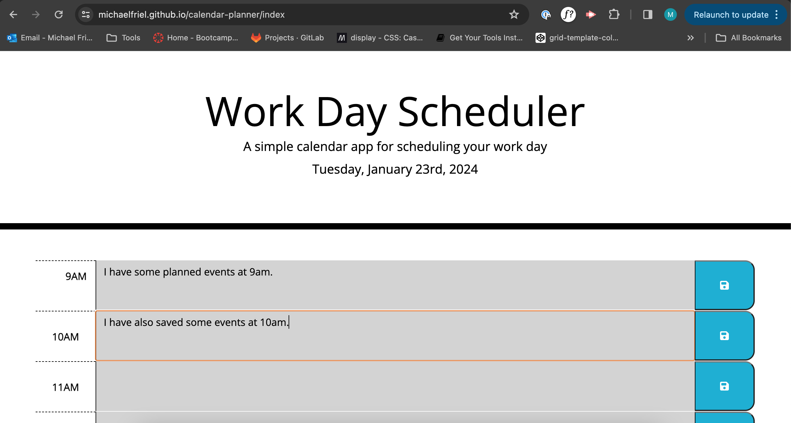
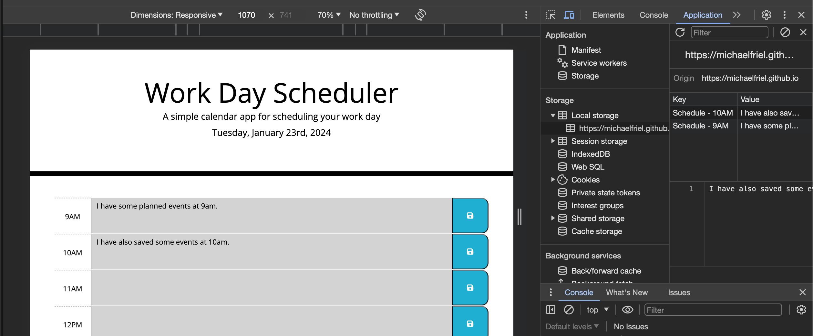

# Calendar Planner

## Description

This application can be used as a daily scheduler/planner, which uses colour coding to represent times which are either past, present or future.

The user can input text in each hourly block and then save the text. 

**The functionality is achieved through the following means:**

* Current time is displayed, using Day.js
* HTML elements dynamically injected via jQuery and a for loop.
* Colours of the blocks are updated using a for loop which compares the current time to the ID of the block.
* Content from text blocks is stored in local storage and retrieved when the page is reloaded. This ensures that the content remains until the user updates it and saves the block again.

**Installation Guide**

To review the quiz, please follow this URL: https://michaelfriel.github.io/calendar-planner/index.html. The code is available to be cloned from the calendar-planner repository, using git commands. To access this, please follow this URL: https://github.com/MichaelFriel/calendar-planner.

**Usage Guide**

The usage for this guide is intuitive and can be clearly understood upon page load.
* The top of the page showcases the current date.
* The page shows times from 9AM - 5AM, with hourly text inputs for the user to add content for their schedule.
* The save icon is used to store the data in local storage and ensure that it is retrievable if the user returns to the page.
* This function could easily be expanded upon to include more times (by changing the for loop to start before i=9)

*This image displays the basic functionality of the application, showing two timeslots populated*

*This image shows the data saved in local storage so that it can be retrieved upon page reload.*

## License
See Mit License contained within repository.
